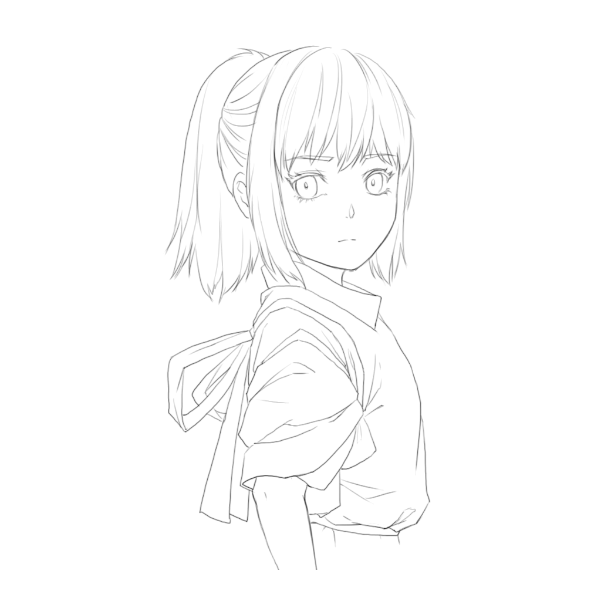
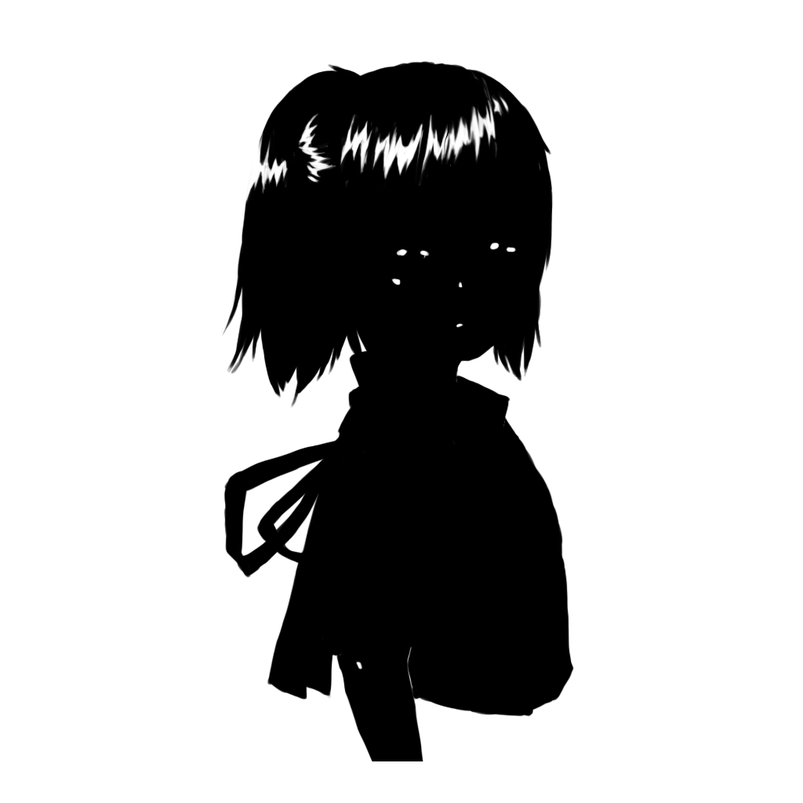

# ArtistColorPipeline

Unity 2020.2 + URP

Art reference: [Spirited Away](https://en.wikipedia.org/wiki/Spirited_Away)

Art reference: [Kakegurui](https://www.google.com/search?q=kakegurui+itsuki)

