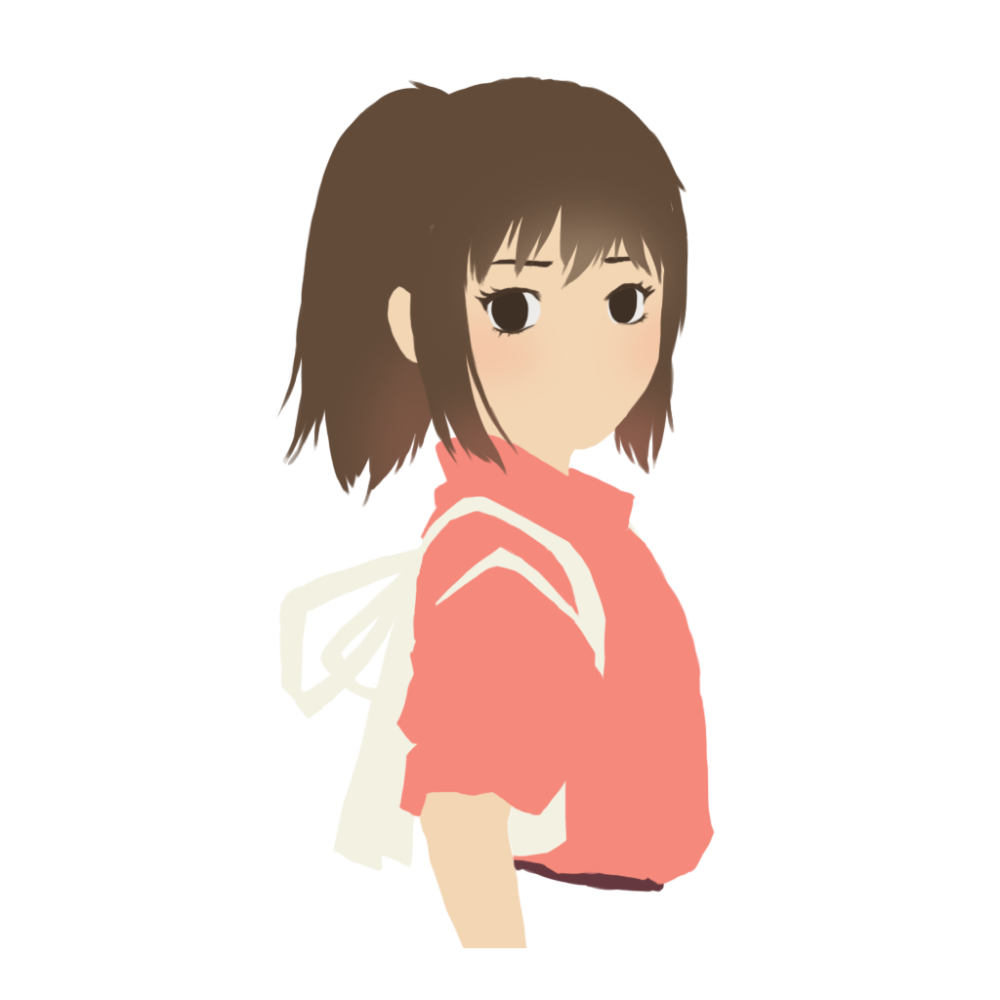
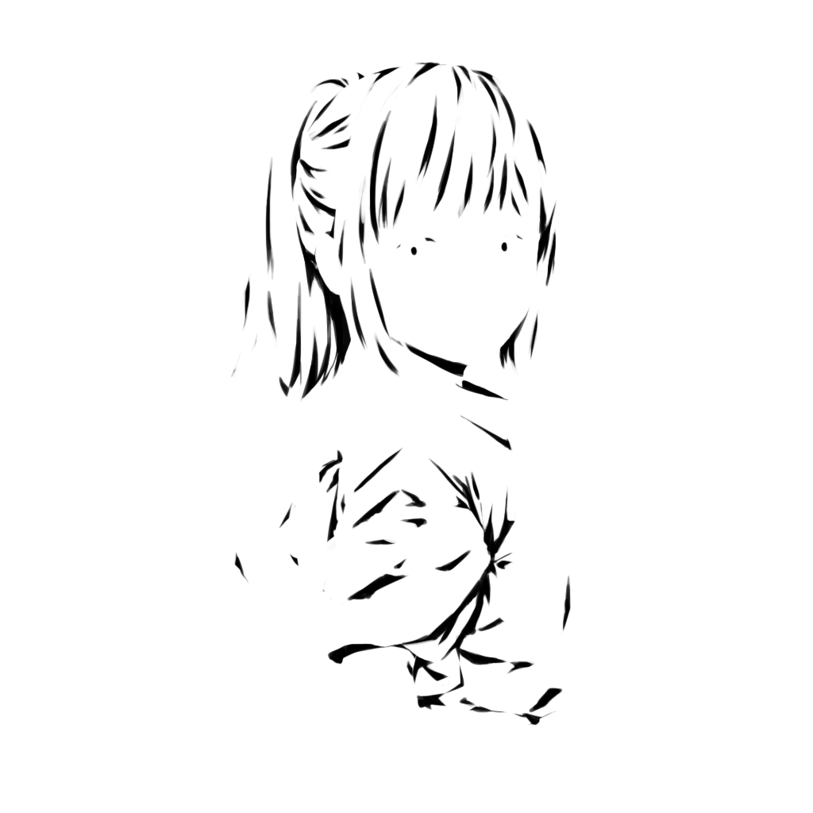
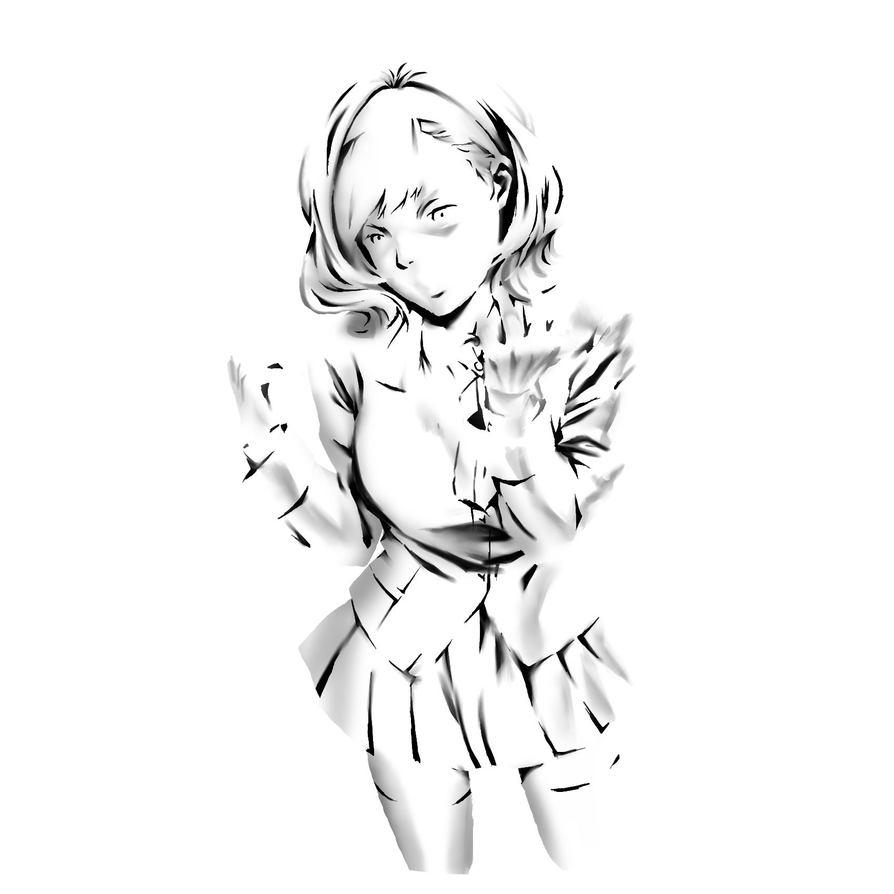
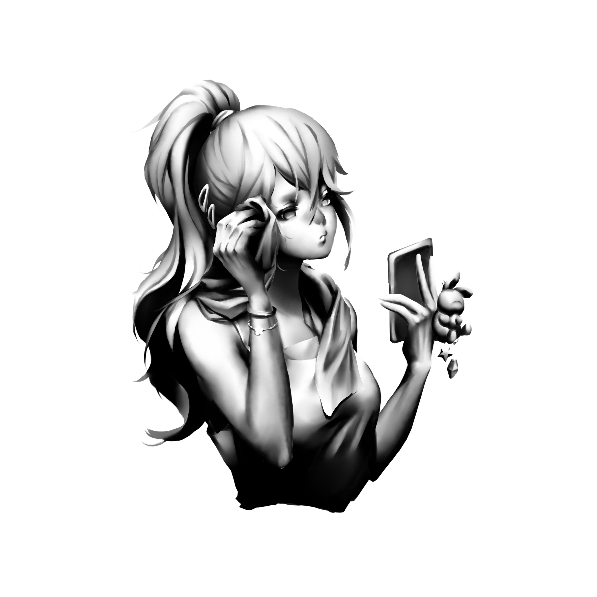

# ArtistColorPipeline

Unity 2020.2 + URP

## Sample 1

Character reference: [Spirited Away](https://en.wikipedia.org/wiki/Spirited_Away)

## Sample 2

Character reference: [Kakegurui](https://www.google.com/search?q=kakegurui+itsuki)

## Sample 3

Style reference: [Kim Hyung Tae](http://wallpoper.com/wallpaper/hyung-tae-kim-422469)

